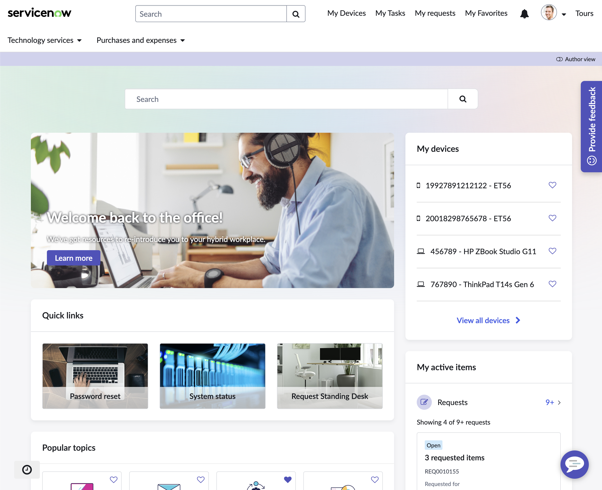
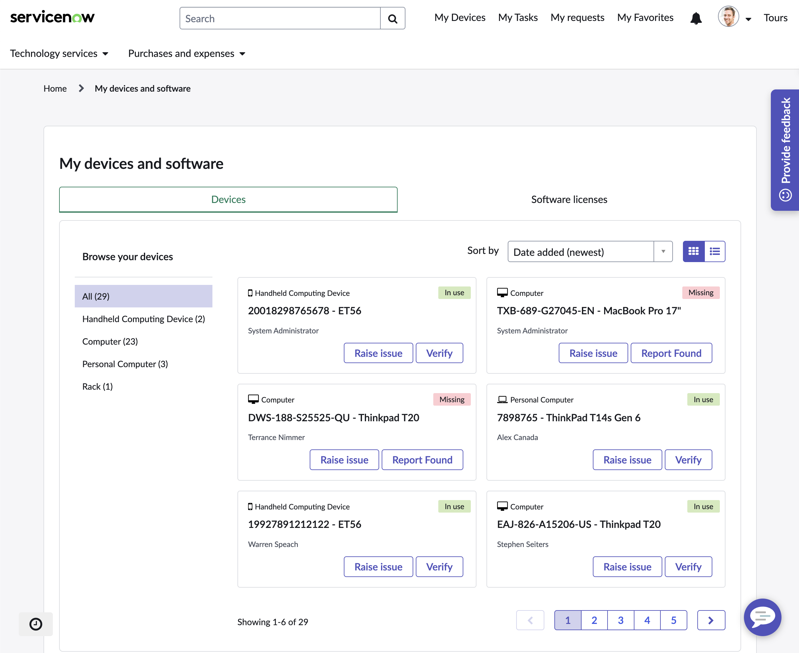
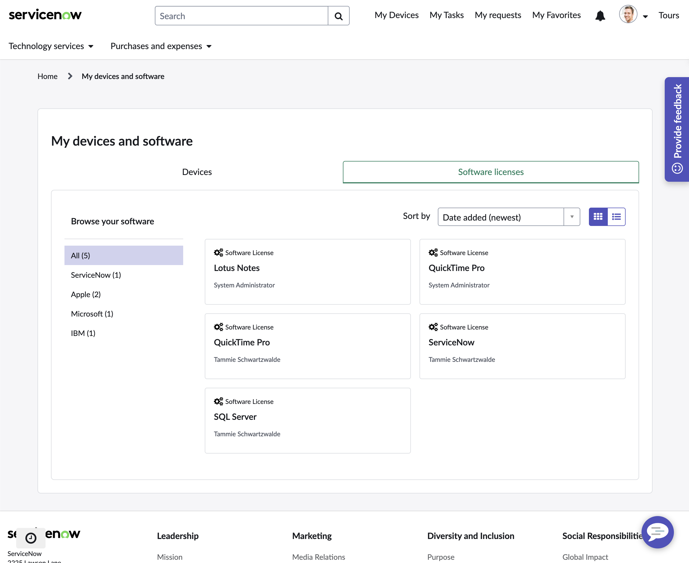
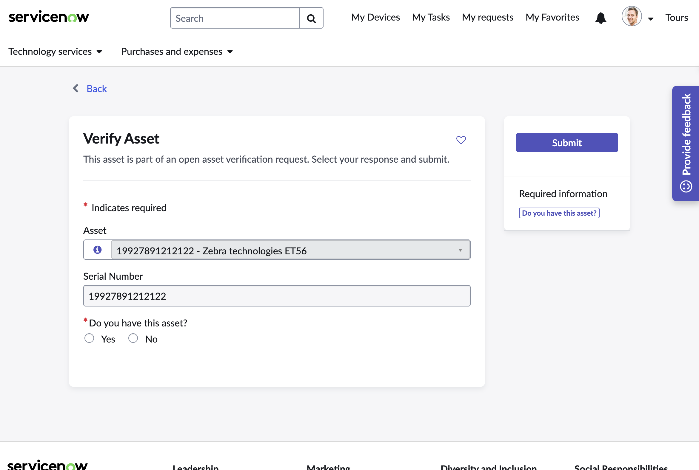

# Custom Employee Center Portal Widgets
Custom widgets to provide employee's with a view of their assigned devices and software licenses.

## Widgets

#### 1. My Devices

A compact widget for the portal homepage that provides quick access to a specific device’s details or a full list of all devices.

#### 2. My Devices and Software

A full-page widget that offers a consolidated view of assigned devices and software licenses, with dynamic actions available on each card based on specific criteria.

#### 3. Verify Asset Page

A dedicated page with a form that allows employees to verify possession of assigned devices or equipment. The verification option appears dynamically if a device hasn’t been verified in the last 12 months.

## Process

This is a high-level outline of the steps I took to build out the various components that make up this solution.

1. Clone out-of-box widgets
2. Create an API or Script Include for gathering data
3. Customize widgets
4. Modify the primary portal page and header menu
5. Create a new portal page for 'My Devices and Software'
6. Create a new portal page for 'Verify Asset'

## Next Steps
I want to create an additional level of detail when an employee clicks on a card. This new card will display more information about the specific device or license, including key lifecycle dates, process guides, and additional actions.